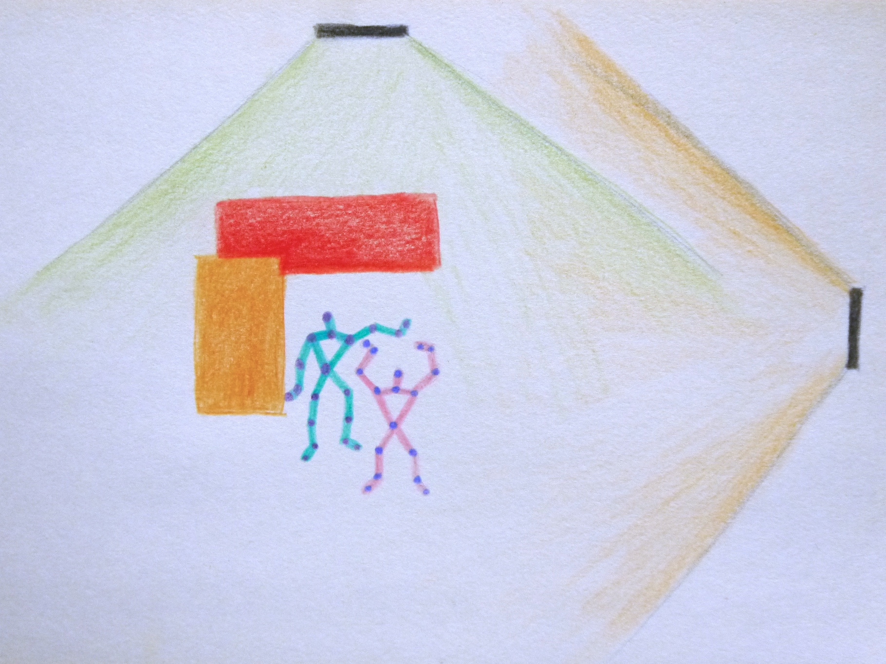

KinectMultiTrack: Tracking People with Multiple Kinects
======

This is the working repository of my, Chi-Jui Wu, undergraduate thesis in the School of Computer Science, University of St Andrews.

The project is about tracking people in occluded environments with multiple Kinects.

## Completed

* DOER and Ethics (26th September, 2014)
* Presentation (8th October, 2014)
* Kinect Serializer (5th November, 2014)
	* BodyFrame
	* Body
	* Joint
* Kinect Client and Server Sockets (5th November, 2014)
* Kinect Visualizer (13th November, 2014)
* Kinect Calibration (4th December, 2014)
* Preliminary Skeleton Matching (30th January, 2015)
* Display Skeletons wrt Different Kienct FOVs (30th January, 2015)
* Logging (20th February, 2015)
* Post-processing (23th February, 2015)
* Preliminary Experiment UI (6th March, 2015)
* Starting Experiments (17th March, 2015)
* Starting the Final Report (18th March, 2015)

## Project Description

#### Problem

